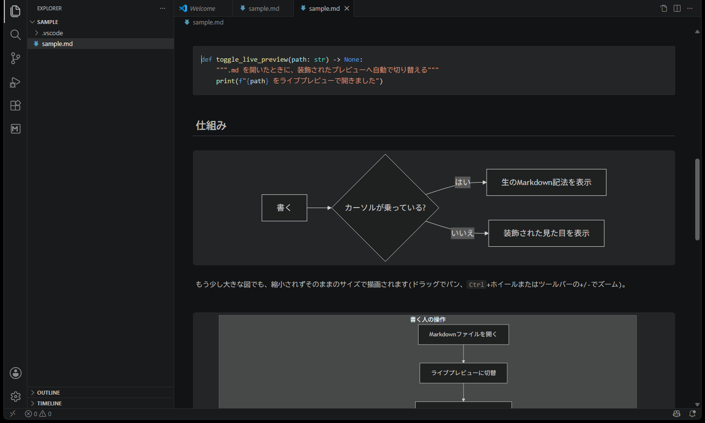
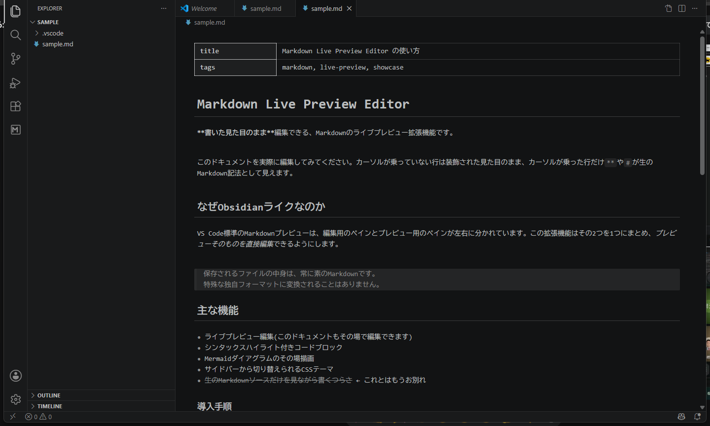
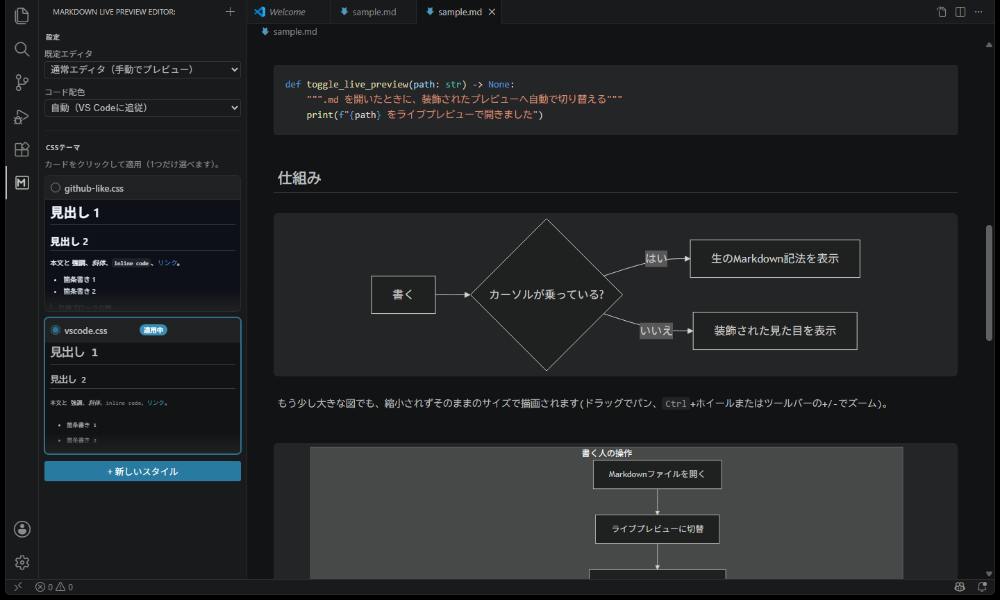

# Markdown Live Preview Editor

**Obsidianのライブプレビューのように、Markdownのプレビュー自体を直接編集できるVS Code拡張機能。**
ファイルの見た目を保ったまま書けて、保存されるのは常に素のMarkdownです。

[](https://marketplace.visualstudio.com/items?itemName=t-shoot.markdown-live-preview-editor)
[](https://marketplace.visualstudio.com/items?itemName=t-shoot.markdown-live-preview-editor)
[](https://marketplace.visualstudio.com/items?itemName=t-shoot.markdown-live-preview-editor)
[](LICENSE)



## なぜこの拡張機能?

VS Codeの標準Markdownプレビューは、編集用のソースペインとプレビューペインが左右に分かれています。
この拡張機能は、その2つを1つにまとめます。

- プレビューそのものが編集可能で、**装飾された見た目のまま**タイプできる
- カーソルが乗っている行だけ`**`や`#`などのMarkdown記法が生テキストで見える(Obsidianと同じ体験)
- ファイルとして保存される中身は常に**素のMarkdown**。特殊な独自フォーマットにはならない
- 既存の`.md`資産やGit管理下のドキュメントをそのまま使える

## 主な機能

### ライブプレビュー編集
CodeMirror 6ベースのカスタムエディタです。見出し・強調・引用・リスト・タスクリスト・リンク・画像・水平線・テーブルなどの記法が、装飾された表示とソース表示をカーソル位置に応じて自動的に切り替わります。`Ctrl+Z` / `Ctrl+Shift+Z`によるアンドゥ・リドゥも通常のエディタと同じ感覚で使えます。



### シンタックスハイライト付きコードブロック
フェンス付きコードブロック(` ```java `など)を[Shiki](https://shiki.style/)で言語ごとに色分け表示します。VS Codeのカラーテーマ(ライト/ダーク)に自動追従する`auto`モードのほか、GitHub配色などを個別に指定することもできます。

### Mermaidダイアグラム
` ```mermaid `フェンスをその場でSVG図として描画します。カーソルを入れると生のMermaid記法に戻り、そのまま編集を続けられます。

### サイドバーのCSSテーマ管理
プライマリサイドバーの「CSS Themes」ビューから、プレビューの見た目を変えるCSSスニペットを複数登録・切替できます。CSSファイルを保存すると、開いているプレビューにホットリロードされます。



## インストール

1. VS Codeの拡張機能ビューで「Markdown Live Preview Editor」を検索してインストール
2. またはMarketplaceのページから: [Markdown Live Preview Editor](https://marketplace.visualstudio.com/items?itemName=t-shoot.markdown-live-preview-editor)
3. またはコマンドラインから:
   ```
   code --install-extension t-shoot.markdown-live-preview-editor
   ```

## クイックスタート

1. `.md`ファイルを開く(既定では通常のテキストエディタで開きます)。
2. エディタタイトルバー右上の切替アイコン(プレビューを開くボタン)をクリックし、Live Previewに切り替える。
3. プレビュー上で直接編集する。カーソルが乗っていない行は装飾表示、カーソルが乗った行だけ生のMarkdown記法が見える。
4. プライマリサイドバーの「CSS Themes」ビューから好みのテーマを有効化する。

`.md`ファイルを常にLive Previewで開きたい場合は、設定`mdLivePreview.defaultEditor`を`livePreview`に変更してください。

## 設定項目

| 設定キー | 説明 |
| --- | --- |
| `mdLivePreview.codeTheme` | コードハイライトの配色(`auto` / `dark-plus` / `light-plus` / `github-dark` / `github-light`)。`auto`はVS Codeのテーマ(ライト/ダーク)に追従します。 |
| `mdLivePreview.enabledStyles` | 現在有効なCSSスニペットのID一覧(サイドバーから操作するため、通常は直接編集不要)。 |
| `mdLivePreview.defaultEditor` | `.md`を開いたときの既定エディタ(`prompt`=標準エディタのまま/`livePreview`=常にLive Preview/`default`=常に標準エディタ)。 |

## 既知の制約

- コードハイライトは主要な言語(JS/TS/Python/Java/C/C++/C#/Go/Rust/Ruby/PHP/HTML/CSS/JSON/YAML/Markdown/Bash/SQL/Kotlin/Swiftなど)に限定しています。対象外の言語は色分けされません。
- テーブルの生編集はObsidianの専用UIほど滑らかではありません(カーソルが入ると生のパイプ記法がそのまま表示されます)。
- タスクリストのチェックボックスはまだ非対話(クリックしてチェックを切り替える機能は未実装)です。

## フィードバック・不具合報告

[GitHub Issues](https://github.com/t-shoot/md-live-preview-editor/issues)からお願いします。

## ライセンス

[MIT](LICENSE)

---

<details>
<summary><strong>開発者向け情報(このリポジトリをビルド・改造する場合)</strong></summary>

### セットアップ

```
npm install
npm run compile
```

開発中は`.vscode/tasks.json`に登録済みの`watch`タスクを使うと、ファイル保存のたびに自動で再ビルド+型チェックされます(esbuildのビルドと`tsc --noEmit --watch`の両方が並行して走ります)。VS Codeで`Terminal > Run Task... > watch`から実行するか、後述の`F5`で自動的に起動します。

エラー内容をVS Codeの「問題」パネルに表示させたい場合は、拡張機能 [connor4312.esbuild-problem-matchers](https://marketplace.visualstudio.com/items?itemName=connor4312.esbuild-problem-matchers) のインストールを推奨します(`.vscode/extensions.json`に登録済みなので、このフォルダを開くとVS Codeが自動でインストールを提案します)。インストールしなくてもビルド自体は問題なく動作します。

#### npm scripts

| スクリプト | 内容 |
| --- | --- |
| `npm run compile` | esbuildで一括ビルド + `tsc --noEmit`で型チェック(1回だけ実行) |
| `npm run typecheck` | 型チェックのみ実行 |
| `npm run watch:esbuild` | esbuildをwatchモードで実行(ビルドのみ、型チェックはしない) |
| `npm run watch:tsc` | `tsc --noEmit --watch`で型チェックのみwatch実行 |
| `npm run vscode:prepublish` | 本番用(minify)ビルド。パッケージング(`vsce package`)時に自動実行される |

### 実行方法(拡張機能を試す)

1. このリポジトリをVS Codeで開く。
2. `F5`を押す(`.vscode/launch.json`の"Run Extension"設定が使われ、`watch`タスクが自動実行されたあとに「Extension Development Host」という新しいVS Codeウィンドウが立ち上がります)。
3. 新しく開いたウィンドウで、同梱の`sample/sample.md`を開く。

`watch`タスクを実行した状態で`F5`すると、コードを変更してもExtension Development Hostのウィンドウで`Ctrl+R`(Reload Window)するだけで最新の変更が反映されます。

### 動作確認の手順

`sample/sample.md`には見出し・太字・斜体・取り消し線・インラインコード・引用・リスト・タスクリスト・リンク・画像・水平線・`java`コードブロック・`mermaid`ブロック・テーブルが一通り含まれています。以下を順に確認してください。

1. 通常のテキストエディタで`sample/sample.md`を開き、エディタタイトルバー右上に切替アイコン(プレビューを開くボタン)が表示されることを確認する。
2. クリックしてLive Previewに切り替わることを確認する。Live Preview側にも「ソースに戻る」アイコンが表示され、クリックで通常エディタに戻れることを確認する。
3. カーソルが乗っていない行では`**`, `#`, `` ` ``などの記号が隠れ、カーソルが乗った行だけ生テキストで見えることを確認する。
4. ` ```java `ブロックが単色ではなく複数の色でハイライトされていることを確認する。
5. ` ```mermaid `ブロックがカーソル外でSVGの図として描画され、カーソルを入れると生テキスト編集に戻ることを確認する。
6. Live Preview側で文字を編集し、ディスク上の`sample/sample.md`(または同じファイルを別タブで開いた通常エディタ)に変更が反映されることを確認する。
7. `Ctrl+Z`で1回分だけ戻り、`Ctrl+Shift+Z`(または`Ctrl+Y`)で1回分だけ進むことを確認する(多重に戻ったり、何も起きなかったりしないこと)。
8. `sample/sample.md`を外部(別タブでの編集や`git checkout`など)から変更し、Live Previewがクラッシュ・内容の重複なく追従することを確認する。
9. プライマリサイドバーの「CSS Themes」ビューを開き、`GitHub-like`や`Obsidian-like`のサンプルスタイルを有効化して見た目が変わることを確認する。CSSファイルを編集して保存すると、開いているLive Previewにホットリロードされることを確認する。
10. 設定`mdLivePreview.defaultEditor`を`livePreview`に変更すると、`.md`ファイルを開いたときに自動でLive Previewが使われることを確認する(`prompt`に戻すと元の挙動に戻ることも確認する)。
11. VS Codeを再起動して`sample/sample.md`を再度Live Previewで開き、有効化したCSSテーマなどの状態が保持されていることを確認する。

</details>
