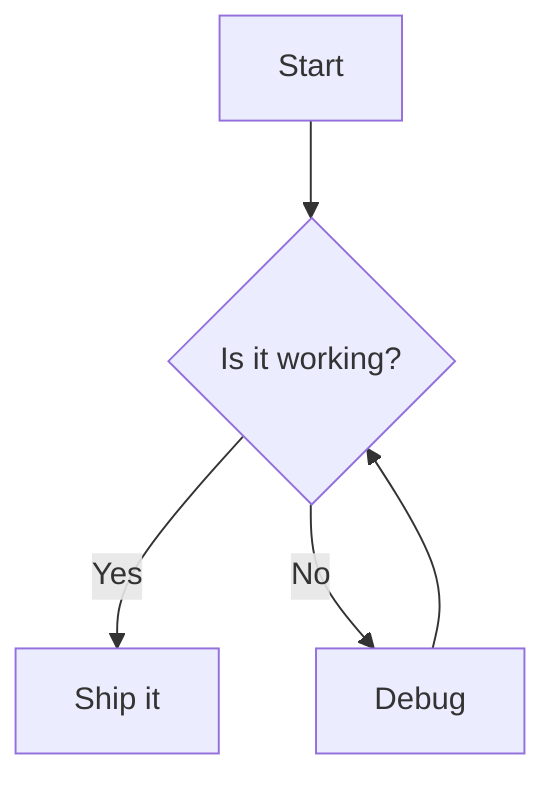

# Heading 1

## Heading 2

This paragraph has **bold text**, *italic text*, ~~strikethrough~~, and `inline code`.

> A blockquote that
> spans two lines.

- Bullet item one
- Bullet item two
1. Ordered item one
2. Ordered item two

- [ ] An unchecked task
- [x] A checked task

---

A [link to example](https://example.com "Example Title") and an image:


```java
class Greeter {
    public static void main(String[] args) {
        System.out.println("Hello, world!");
    }
}
```



| Column A | Column B |
| -------- | -------- |
| 1        | 2        |
| 3        | 4        |
